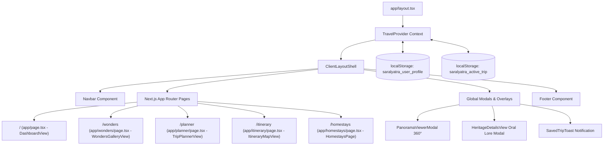

# System Architecture & State Management

This document details the architectural principles, component relationships, state persistence, and data flow of the **Saral Yatra** application.

---

## 1. High-Level Architectural Diagram

---

## 2. Next.js App Router & Layout Hierarchy

### Root Layout (`app/layout.tsx`)
- Server-rendered entry shell loading global CSS, Google Fonts (`Cinzel`, `Plus Jakarta Sans`), and Leaflet CSS stylesheets.
- Injects `Metadata` for SEO (title, description, favicons).
- Wraps all child routes inside `<TravelProvider>` and `<ClientLayoutShell>`.

### Client Layout Shell (`components/layout/ClientLayoutShell.tsx`)
- Renders the sticky top [Navbar.tsx](file:///Users/rajdeepvala/code/projects/saralyatra/components/layout/Navbar.tsx).
- Injects active modals:
  - **360° Panorama Tour Modal** (`selected360Monument`)
  - **Full Editorial Heritage & Oral Lore Modal** (`selectedDetailMonument`)
  - **Saved Trip Toast Notification** (`savedTripToast`)
- Renders `<Footer />` pinned to the bottom.

---

## 3. State Management (`context/TravelContext.tsx`)

The application uses a centralized React Context (`TravelContext`) coupled with a custom hook `useTravel()`.

### State Properties Managed:

| State Key | Type | Description |
|---|---|---|
| `currentLang` | `LanguageCode` | Active language (`en`, `hi`, `mr`, `gu`, `bn`, `ta`) used for UI and audio narration. |
| `searchQuery` | `string` | Search keyword synced between Navbar and Wonders gallery. |
| `userProfile` | `UserProfile` | Traveler identity, dietary customs (`pureVeg`, `jain`, `halal`, `any`), home state, and saved trips. |
| `activeTrip` | `PreloadedTrip \| null` | The active itinerary displayed on the live route map. |
| `activeStopId` | `string` | Currently highlighted stop on the map and day timeline. |
| `filterPreferences` | `FilterPreferences` | Wizard configuration (theme, region, duration, pacing, dietary, ratio). |
| `selectedDetailMonument`| `Monument \| null` | Trigger for the full folklore story & audio narration modal. |
| `selected360Monument` | `Monument \| null` | Trigger for the interactive 360° panoramic viewer. |
| `savedTripToast` | `{ title, message } \| null`| Toast notification triggering after confirming/saving a trip. |

### Persistence Mechanism:
1. **User Profile**: Automatically serialized into `localStorage.getItem("saralyatra_user_profile")`.
2. **Active Itinerary**: Automatically serialized into `localStorage.getItem("saralyatra_active_trip")`. This ensures that refreshing the browser or navigating between `/planner`, `/itinerary`, and `/` does not wipe the generated trip.
3. **Lazy Initializers**: All `localStorage` reads occur inside `useState(() => ...)` lazy initializers to ensure optimal rendering performance in React 19.

---

## 4. Cross-Route Action Handlers

`TravelContext` exposes reusable actions that coordinate UI updates and route transitions:

- `handleLoadDemoTrip(regionKey: string)`:
  1. Retrieves preloaded trip (e.g. `kerala`, `rajasthan`, `varanasi`, `hampi`) or dynamically generates an itinerary for any Indian state using `generateDynamicItinerary`.
  2. Sets `activeTrip`, `activeStopId`, and updates `filterPreferences`.
  3. Seamlessly redirects to `/itinerary`.

- `handleSaveTrip(tripToSave: PreloadedTrip)`:
  1. Assigns a unique ID and appends the trip to `userProfile.savedTrips`.
  2. Resets `activeTrip` and `activeStopId`.
  3. Resets `filterPreferences` to clean defaults for the next journey.
  4. Triggers the celebration toast and navigates back to `/`.

- `handleLoadSavedTrip(savedTrip: PreloadedTrip)`:
  1. Re-activates the saved trip in `activeTrip`.
  2. Restores its cultural filters and region settings.
  3. Navigates to `/itinerary`.

- `handleDeleteSavedTrip(tripId: string)`:
  1. Filters out the specified trip from `userProfile.savedTrips` and updates `localStorage`.

- `handleOpenDetailsById(monumentId: string)`:
  1. Searches the `monuments` dataset for the ID.
  2. If not found in the static dataset (e.g. custom stop from active itinerary), dynamically creates a synthesized monument entry.
  3. Opens `HeritageDetailsView` modal.
