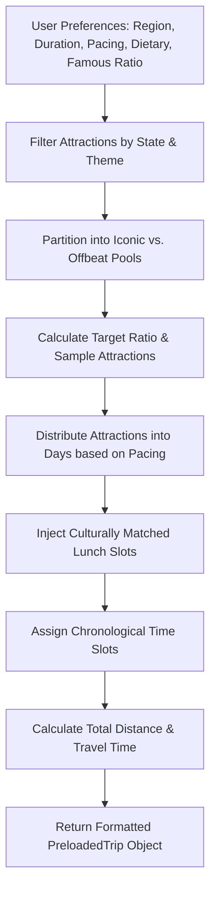

# Trip Engine & Routing Algorithms

This document details the algorithmic logic and mathematical functions in [utils/tripEngine.ts](file:///Users/rajdeepvala/code/projects/saralyatra/utils/tripEngine.ts) and [MapRouteVisualizer.tsx](file:///Users/rajdeepvala/code/projects/saralyatra/components/planner/MapRouteVisualizer.tsx).

---

## 1. Geographic Distance: Haversine Formula

To calculate the great-circle distance between any two coordinate waypoints on Earth, `getDistanceKm()` implements the Haversine formula:

$$\Delta\text{lat} = \text{lat}_2 - \text{lat}_1$$
$$\Delta\text{lon} = \text{lon}_2 - \text{lon}_1$$
$$a = \sin^2\left(\frac{\Delta\text{lat}}{2}\right) + \cos(\text{lat}_1)\cos(\text{lat}_2)\sin^2\left(\frac{\Delta\text{lon}}{2}\right)$$
$$c = 2 \cdot \text{atan2}\left(\sqrt{a}, \sqrt{1-a}\right)$$
$$d = R \cdot c \quad (R = 6371\text{ km})$$

```typescript
export function getDistanceKm(lat1: number, lon1: number, lat2: number, lon2: number): number {
  const R = 6371; // Earth radius in km
  const dLat = (lat2 - lat1) * (Math.PI / 180);
  const dLon = (lon2 - lon1) * (Math.PI / 180);
  const a =
    Math.sin(dLat / 2) * Math.sin(dLat / 2) +
    Math.cos(lat1 * (Math.PI / 180)) *
      Math.cos(lat2 * (Math.PI / 180)) *
      Math.sin(dLon / 2) *
      Math.sin(dLon / 2);
  const c = 2 * Math.atan2(Math.sqrt(a), Math.sqrt(1 - a));
  return Math.round(R * c);
}
```

---

## 2. Dynamic Itinerary Generation (`generateDynamicItinerary`)

When the user configures their travel preferences in the AI Planner Wizard, the algorithm executes the following sequence:



### Key Parameters:
1. **Attraction Partitioning**:
   - Attractions in the target region are split into `iconicPool` (`isOffbeat: false`) and `offbeatPool` (`isOffbeat: true`).
   - The user's `famousRatio` slider (e.g. 70%) determines the proportion sampled from each pool.

2. **Daily Pacing Allocation**:
   - **Relaxed**: 2 destination stops per day.
   - **Moderate**: 3 destination stops per day.
   - **Intensive**: 4 destination stops per day.

3. **Dietary-Aware Lunch Injection**:
   - Midday slots (1:00 PM - 2:00 PM) automatically inject a culturally relevant dining stop:
     - `pureVeg`: "Traditional Pure Veg Thali & Local Flavors"
     - `jain`: "Satvik Jain Bhojanalaya (No Onion/Garlic)"
     - `halal`: "Regional Specialty Kitchen & Halal Dining"
     - `any`: "Local Traditional Cuisine & Food Trail"

4. **Time Scheduling**:
   - Morning: 09:00 AM – 11:30 AM
   - Midday / Lunch: 01:00 PM – 02:00 PM
   - Afternoon: 02:30 PM – 04:30 PM
   - Evening / Sunset: 05:00 PM – 07:00 PM

---

## 3. Real-Time Itinerary Mutation & Stat Recalculation

When a user adds or removes a destination on the live map:

### `removeDestinationFromTrip(trip, dayNumber, stopId)`
- Filters out the stop from the target day.
- Invokes `recalculateTripStats()`.

### `addDestinationToTrip(trip, dayNumber, monument)`
- Injects a new `ItineraryStop` into the selected day with appropriate time allocation based on current stop count.
- Inherits coordinates (`lat`, `lng`), category, and description from the monument.
- Invokes `recalculateTripStats()`.

### `recalculateTripStats(itinerary)`
- Iterates sequentially through all stops with valid coordinates across all days.
- Computes cumulative driving distance in kilometers.
- Estimates driving duration assuming average Indian highway / urban transit speeds ($40\text{ km/h} + \text{daily baseline}$).
- Counts total heritage/nature/spiritual destination stops.

---

## 4. Highway Spline Curvature Interpolation

In [components/planner/MapRouteVisualizer.tsx](file:///Users/rajdeepvala/code/projects/saralyatra/components/planner/MapRouteVisualizer.tsx), when rendering roads between stops on the Leaflet map, straight lines look unrealistic. The system uses a **Quadratic Bezier Curve Algorithm** to simulate natural highway curves:

```typescript
function generateCurvedRoadPath(coords: [number, number][]): [number, number][] {
  if (coords.length < 2) return coords;
  const path: [number, number][] = [];

  for (let i = 0; i < coords.length - 1; i++) {
    const p1 = coords[i];
    const p2 = coords[i + 1];
    const pointsCount = 18;

    const midLat = (p1[0] + p2[0]) / 2;
    const midLng = (p1[1] + p2[1]) / 2;
    const dLat = p2[0] - p1[0];
    const dLng = p2[1] - p1[1];
    
    // Alternating perpendicular displacement
    const curveIntensity = 0.08 * (i % 2 === 0 ? 1 : -1);
    const ctrlLat = midLat - dLng * curveIntensity;
    const ctrlLng = midLng + dLat * curveIntensity;

    for (let t = 0; t <= 1; t += 1 / pointsCount) {
      const lat = (1 - t) * (1 - t) * p1[0] + 2 * (1 - t) * t * ctrlLat + t * t * p2[0];
      const lng = (1 - t) * (1 - t) * p1[1] + 2 * (1 - t) * t * ctrlLng + t * t * p2[1];
      path.push([lat, lng]);
    }
  }

  path.push(coords[coords.length - 1]);
  return path;
}
```
